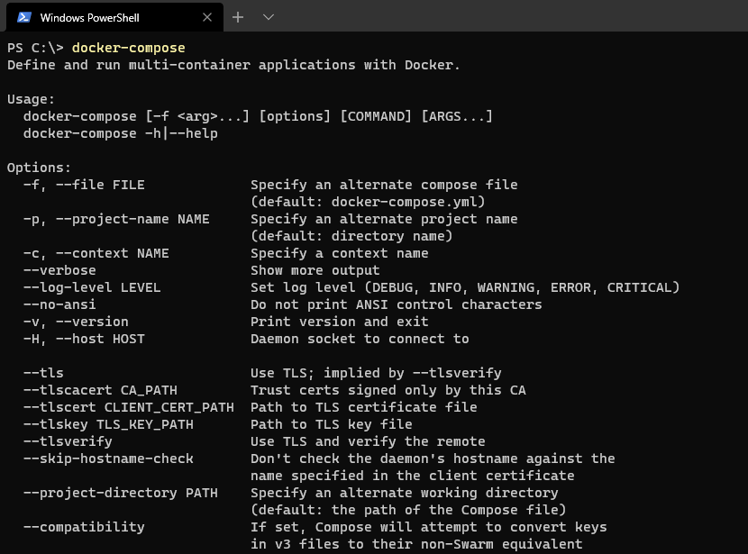
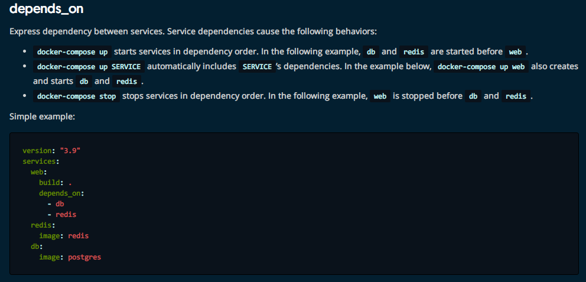
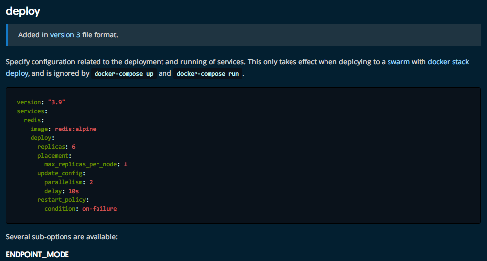
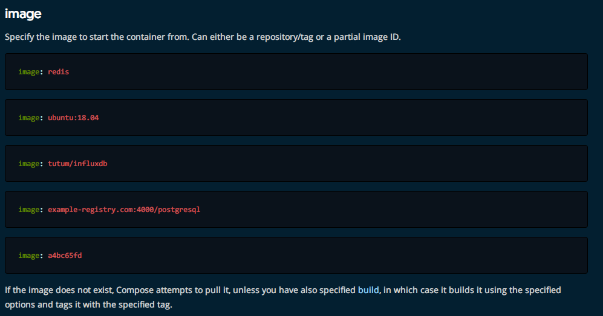

# Docker 进阶

按照[狂神的视频](https://www.bilibili.com/video/BV1kv411q7Qc)做的笔记。

## Docker Compose

> 官方介绍：

> Compose is a tool for defining and running multi-container Docker applications. With Compose, you use a YAML file to configure your application’s services. Then, with a single command, you create and start all the services from your configuration. To learn more about all the features of Compose, see the list of features.
>
> Compose works in all environments: production, staging, development, testing, as well as CI workflows. You can learn more about each case in Common Use Cases.
>
> Using Compose is basically a three-step process:
>
> 1. Define your app’s environment with a Dockerfile so it can be reproduced anywhere.
> 2. Define the services that make up your app in docker-compose.yml so they can be run together in an isolated environment.
> 3. Run docker-compose up and Compose starts and runs your entire app.
>

**翻译：**

> Compose是一个用来定义和运行多容器Docker应用的工具。有了它，你可以用一个YAML文件来配置你的应用的服务。然后，你可以通过一行命令依照你的配置文件创建和启动所有的服务。想了解更多有关于Compose的功能，请看[功能列表](https://docs.docker.com/compose/#features)。
>
> Compose可以用在所有的场景中：生产、展示、开发、测试，以及CI工作流。你可以在[常用案例](https://docs.docker.com/compose/#common-use-cases)了解更多。
>
> 使用Compose基本上是一个三步过程：
>
> 1. 用`Dockerfile`定义你的应用程序的环境，你可以把它发布到任何地方。
>
> 2. 定义在`docker-compose.yml`中定义组成应用程序的服务，以便它们可以在隔离的环境中一起运行。
> 3. 运行`docker-compose up`，然后Compose启动并运行整个应用程序。

Compose是Docker官方的开源项目，需要安装。

`Dockerfile` 让程序在任何地方运行。

Compose：

```yaml
version: "3.9"  # optional since v1.27.0
services:
  web:
    build: .
    ports:
      - "5000:5000"
    volumes:
      - .:/code
      - logvolume01:/var/log
    links:
      - redis
  redis:
    image: redis
volumes:
  logvolume01: {}
```

`docker-compose up`

## 安装

Windows不需要另外安装。

```powershell
PS C:\> docker-compose
Define and run multi-container applications with Docker.

Usage:
  docker-compose [-f <arg>...] [options] [COMMAND] [ARGS...]
  docker-compose -h|--help

Options:
  -f, --file FILE             Specify an alternate compose file
                              (default: docker-compose.yml)
  -p, --project-name NAME     Specify an alternate project name
                              (default: directory name)
  -c, --context NAME          Specify a context name
  --verbose                   Show more output
  --log-level LEVEL           Set log level (DEBUG, INFO, WARNING, ERROR, CRITICAL)
  --no-ansi                   Do not print ANSI control characters
  -v, --version               Print version and exit
  -H, --host HOST             Daemon socket to connect to

  --tls                       Use TLS; implied by --tlsverify
  --tlscacert CA_PATH         Trust certs signed only by this CA
  --tlscert CLIENT_CERT_PATH  Path to TLS certificate file
  --tlskey TLS_KEY_PATH       Path to TLS key file
  --tlsverify                 Use TLS and verify the remote
  --skip-hostname-check       Don't check the daemon's hostname against the
                              name specified in the client certificate
  --project-directory PATH    Specify an alternate working directory
                              (default: the path of the Compose file)
  --compatibility             If set, Compose will attempt to convert keys
                              in v3 files to their non-Swarm equivalent
  --env-file PATH             Specify an alternate environment file

Commands:
  build              Build or rebuild services
  config             Validate and view the Compose file
  create             Create services
  down               Stop and remove containers, networks, images, and volumes
  events             Receive real time events from containers
  exec               Execute a command in a running container
  help               Get help on a command
  images             List images
  kill               Kill containers
  logs               View output from containers
  pause              Pause services
  port               Print the public port for a port binding
  ps                 List containers
  pull               Pull service images
  push               Push service images
  restart            Restart services
  rm                 Remove stopped containers
  run                Run a one-off command
  scale              Set number of containers for a service
  start              Start services
  stop               Stop services
  top                Display the running processes
  unpause            Unpause services
  up                 Create and start containers
  version            Show the Docker-Compose version information
```



**检查版本：**

```powershell
PS C:\> docker-compose version
docker-compose version 1.26.2, build eefe0d31
docker-py version: 4.2.2
CPython version: 3.7.4
OpenSSL version: OpenSSL 1.1.1c  28 May 2019
```


## Docker-compose初体验

参见[官网](https://docs.docker.com/compose/gettingstarted/) 。

一个简单的Python应用，使用到flask。

### 准备工作

创建一个文件夹。

```powershell
PS C:\workspace\Docker> mkdir composetest
PS C:\workspace\Docker> cd .\composetest\
PS C:\workspace\Docker\composetest>
```

创建名为`app.py`的文件，并且粘贴这些内容：

```python
import time

import redis
from flask import Flask

app = Flask(__name__)
cache = redis.Redis(host='redis', port=6379)

def get_hit_count():
    retries = 5
    while True:
        try:
            return cache.incr('hits')
        except redis.exceptions.ConnectionError as exc:
            if retries == 0:
                raise exc
            retries -= 1
            time.sleep(0.5)

@app.route('/')
def hello():
    count = get_hit_count()
    return 'Hello World! I have been seen {} times.\n'.format(count)
```

创建一个依赖文件`requirements.txt`

```
flask
redis
```

### 创建DockerFile

在目录下创建`dockerfile`。

```dockerfile
FROM python:3.7-alpine
WORKDIR /code
ENV FLASK_APP=app.py
ENV FLASK_RUN_HOST=0.0.0.0
RUN apk add --no-cache gcc musl-dev linux-headers
COPY requirements.txt requirements.txt
RUN pip install -r requirements.txt
EXPOSE 5000
COPY . .
CMD ["flask", "run"]
```

> This tells Docker to:
>
> - Build an image starting with the Python 3.7 image.
> - Set the working directory to `/code`.
> - Set environment variables used by the `flask` command.
> - Install gcc and other dependencies
> - Copy `requirements.txt` and install the Python dependencies.
> - Add metadata to the image to describe that the container is listening on port 5000
> - Copy the current directory `.` in the project to the work directory `.` in the image.
> - Set the default command for the container to `flask run`.

### 在Compose文件中定义服务

创建`docker-compose.yml` 并粘贴一下内容：

```yaml
version: "3.9"
services:
  web:
    build: .
    ports:
      - "5000:5000"
  redis:
    image: "redis:alpine"
```

### 使用Compose构建和运行应用

运行`docker-compose up` 。

```powershell
PS C:\workspace\Docker\composetest> docker-compose up
Creating network "composetest_default" with the default driver
Building web
Step 1/10 : FROM python:3.7-alpine
3.7-alpine: Pulling from library/python
4c0d98bf9879: Pull complete
5e807dbff582: Pull complete
5c0d1f839dbc: Pull complete
4c078d76f332: Pull complete
eb33935d7166: Pull complete
Digest: sha256:78ac413ed94bd2ec0db2ab2879f95f57622d4c6e1cddf78ea639a7af531cdb1e
Status: Downloaded newer image for python:3.7-alpine
 ---> fc9f1d71c77d
Step 2/10 : WORKDIR /code
 ---> Running in 2ee4db468015
Removing intermediate container 2ee4db468015
 ---> d672cb5718e4
Step 3/10 : ENV FLASK_APP=app.py
 ---> Running in 03cac0835b83
Removing intermediate container 03cac0835b83
 ---> e9110d8e1650
Step 4/10 : ENV FLASK_RUN_HOST=0.0.0.0
 ---> Running in 72514e7a06cf
Removing intermediate container 72514e7a06cf
 ---> f3791d9cae5b
Step 5/10 : RUN apk add --no-cache gcc musl-dev linux-headers
 ---> Running in e50c7936457d
fetch https://dl-cdn.alpinelinux.org/alpine/v3.13/main/x86_64/APKINDEX.tar.gz
fetch https://dl-cdn.alpinelinux.org/alpine/v3.13/community/x86_64/APKINDEX.tar.gz
(1/13) Installing libgcc (10.2.1_pre1-r3)
(2/13) Installing libstdc++ (10.2.1_pre1-r3)
(3/13) Installing binutils (2.35.1-r1)
(4/13) Installing libgomp (10.2.1_pre1-r3)
(5/13) Installing libatomic (10.2.1_pre1-r3)
(6/13) Installing libgphobos (10.2.1_pre1-r3)
(7/13) Installing gmp (6.2.1-r0)
(8/13) Installing isl22 (0.22-r0)
(9/13) Installing mpfr4 (4.1.0-r0)
(10/13) Installing mpc1 (1.2.0-r0)
(11/13) Installing gcc (10.2.1_pre1-r3)
(12/13) Installing linux-headers (5.7.8-r0)
(13/13) Installing musl-dev (1.2.2-r0)
Executing busybox-1.32.1-r2.trigger
OK: 139 MiB in 48 packages
Removing intermediate container e50c7936457d
 ---> 7e1cef4a7d35
Step 6/10 : COPY requirements.txt requirements.txt
 ---> 33787017e99e
Step 7/10 : RUN pip install -r requirements.txt
 ---> Running in ffa2cb3c992e
Collecting flask
  Downloading Flask-1.1.2-py2.py3-none-any.whl (94 kB)
Collecting redis
  Downloading redis-3.5.3-py2.py3-none-any.whl (72 kB)
Collecting Werkzeug>=0.15
  Downloading Werkzeug-1.0.1-py2.py3-none-any.whl (298 kB)
Collecting Jinja2>=2.10.1
  Downloading Jinja2-2.11.3-py2.py3-none-any.whl (125 kB)
Collecting itsdangerous>=0.24
  Downloading itsdangerous-1.1.0-py2.py3-none-any.whl (16 kB)
Collecting click>=5.1
  Downloading click-7.1.2-py2.py3-none-any.whl (82 kB)
Collecting MarkupSafe>=0.23
  Downloading MarkupSafe-1.1.1.tar.gz (19 kB)
Building wheels for collected packages: MarkupSafe
  Building wheel for MarkupSafe (setup.py): started
  Building wheel for MarkupSafe (setup.py): finished with status 'done'
  Created wheel for MarkupSafe: filename=MarkupSafe-1.1.1-cp37-cp37m-linux_x86_64.whl size=17026 sha256=28c7de04ceb1a600ed306afc53da582ffb533a34686516eba089d95830dbca4b
  Stored in directory: /root/.cache/pip/wheels/b9/d9/ae/63bf9056b0a22b13ade9f6b9e08187c1bb71c47ef21a8c9924
Successfully built MarkupSafe
Installing collected packages: MarkupSafe, Werkzeug, Jinja2, itsdangerous, click, redis, flask
Successfully installed Jinja2-2.11.3 MarkupSafe-1.1.1 Werkzeug-1.0.1 click-7.1.2 flask-1.1.2 itsdangerous-1.1.0 redis-3.5.3
Removing intermediate container ffa2cb3c992e
 ---> de30d2ed736a
Step 8/10 : EXPOSE 5000
 ---> Running in 0adc85f81a26
Removing intermediate container 0adc85f81a26
 ---> 986aa8703a07
Step 9/10 : COPY . .
 ---> 47c2c04b2e4c
Step 10/10 : CMD ["flask", "run"]
 ---> Running in f0e71f0c824f
Removing intermediate container f0e71f0c824f
 ---> 6d16acf37823

Successfully built 6d16acf37823
Successfully tagged composetest_web:latest
WARNING: Image for service web was built because it did not already exist. To rebuild this image you must use `docker-compose build` or `docker-compose up --build`.
Pulling redis (redis:alpine)...
alpine: Pulling from library/redis
4c0d98bf9879: Already exists
cc1404096495: Pull complete
6ca68aee953e: Pull complete
5d65ae1c666f: Pull complete
c8b085ca330a: Pull complete
054f304e4d13: Pull complete
Digest: sha256:d2b1b0bf521f55381c81b1bc0218aec4ddc92fb545e9e8492e8ff324462eed58
Status: Downloaded newer image for redis:alpine
Creating composetest_web_1   ... done
Creating composetest_redis_1 ... done
Attaching to composetest_redis_1, composetest_web_1
redis_1  | 1:C 16 Feb 2021 09:03:57.040 # oO0OoO0OoO0Oo Redis is starting oO0OoO0OoO0Oo
redis_1  | 1:C 16 Feb 2021 09:03:57.040 # Redis version=6.0.10, bits=64, commit=00000000, modified=0, pid=1, just started
redis_1  | 1:C 16 Feb 2021 09:03:57.040 # Warning: no config file specified, using the default config. In order to specify a config file use redis-server /path/to/redis.conf
redis_1  | 1:M 16 Feb 2021 09:03:57.041 * Running mode=standalone, port=6379.
redis_1  | 1:M 16 Feb 2021 09:03:57.041 # Server initialized
redis_1  | 1:M 16 Feb 2021 09:03:57.041 # WARNING overcommit_memory is set to 0! Background save may fail under low memory condition. To fix this issue add 'vm.overcommit_memory = 1' to /etc/sysctl.conf and then reboot or run the command 'sysctl vm.overcommit_memory=1' for this to take effect.
redis_1  | 1:M 16 Feb 2021 09:03:57.041 # WARNING you have Transparent Huge Pages (THP) support enabled in your kernel. This will create latency and memory usage issues with Redis. To fix this issue run the command 'echo madvise > /sys/kernel/mm/transparent_hugepage/enabled' as root, and add it to your /etc/rc.local in order to retain the setting after a reboot. Redis must be restarted after THP is disabled (set to 'madvise' or 'never').
redis_1  | 1:M 16 Feb 2021 09:03:57.041 * Ready to accept connections
web_1    |  * Serving Flask app "app.py"
web_1    |  * Environment: production
web_1    |    WARNING: This is a development server. Do not use it in a production deployment.
web_1    |    Use a production WSGI server instead.
web_1    |  * Debug mode: off
web_1    |  * Running on http://0.0.0.0:5000/ (Press CTRL+C to quit)
```

注意：

```
WARNING: Image for service web was built because it did not already exist. To rebuild this image you must use `docker-compose build` or `docker-compose up --build`.
```

所以刚刚的步骤并不严谨，应该先执行`docker-compose build`

然后再执行`docker-compose up`

停止的方法：`docker-compose down`或者`Ctrl+C`。


### 一些解释

1. 应用`app.py`。
2. Dockerfile 应用打包为镜像。
3. Docker-compose yaml文件，完整的上线服务。
4. 启动Compose项目（docker-compose up）

流程：

1. 创建网络
2. 执行yaml文件
3. 启动服务

```
Creating composetest_web_1   ... done
Creating composetest_redis_1 ... done
```

`docker images`

```powershell
PS C:\workspace\Docker\composetest> docker images
REPOSITORY          TAG                 IMAGE ID            CREATED             SIZE
composetest_web     latest              6d16acf37823        18 minutes ago      182MB
python              3.7-alpine          fc9f1d71c77d        12 days ago         41.6MB
redis               alpine              18e4b21eb324        2 weeks ago         31.3MB
ubuntu              latest              f63181f19b2f        3 weeks ago         72.9MB
```

用Compose自动创建了这些镜像。

`docker ps`

```powershell
PS C:\workspace\Docker\composetest> docker ps -a
CONTAINER ID        IMAGE               COMMAND                  CREATED             STATUS                       PORTS               NAMES
986ffd99f6b1        redis:alpine        "docker-entrypoint.s…"   17 seconds ago      Exited (0) 14 seconds ago
              composetest_redis_1
eddfcef1b0f7        composetest_web     "flask run"              17 seconds ago      Exited (137) 4 seconds ago
              composetest_web_1
```

`docker service ls`

```powershell
PS C:\workspace\Docker\composetest> docker service ls
Error response from daemon: This node is not a swarm manager. Use "docker swarm init" or "docker swarm join" to connect this node to swarm and try again.
```

这个命令请听下回分解。


默认服务名：文件名\_服务名\_num

为什么要有\_num呢？_num表示副本数量，因为项目通常是跑在多个服务器上，组成集群。所以一个服务可能在不同服务器上有多个副本，加上num以区分。

比如：部署redis服务，可能需要多个副本。未来集群状态下需要使用，服务不可能只有一个运行实例。作用：*弹性、高并发*

```powershell
PS C:\workspace\Docker\composetest> docker network ls
NETWORK ID          NAME                  DRIVER              SCOPE
e51341c7ea29        bridge                bridge              local
17b90c637f1c        composetest_default   bridge              local
b68689a26580        host                  host                local
0f425d7fa7f0        none                  null                local
```

如果启动多个服务，则项目中的内容都在同个网络下，可以通过域名访问。

查看网络详细信息：

```powershell
PS C:\workspace\Docker\composetest> docker network inspect composetest_default
[
    {
        "Name": "composetest_default",
        "Id": "17b90c637f1c58f7222b27698bb496ad88460e1f9e99b2c0a519d217372c40c4",
        "Created": "2021-02-16T09:00:35.2380161Z",
        "Scope": "local",
        "Driver": "bridge",
        "EnableIPv6": false,
        "IPAM": {
            "Driver": "default",
            "Options": null,
            "Config": [
                {
                    "Subnet": "172.18.0.0/16",
                    "Gateway": "172.18.0.1"
                }
            ]
        },
        "Internal": false,
        "Attachable": true,
        "Ingress": false,
        "ConfigFrom": {
            "Network": ""
        },
        "ConfigOnly": false,
        "Containers": {
            "986ffd99f6b14369243dad41341f5a09a8917c90f23fef0786dca12a700627f2": {
                "Name": "composetest_redis_1",
                "EndpointID": "62b8db431ccbfeca7d5bddeb6df198dd908ec2fdb56088426065bc2c2d499f4a",
                "MacAddress": "02:42:ac:12:00:03",
                "IPv4Address": "172.18.0.3/16",
                "IPv6Address": ""
            },
            "eddfcef1b0f72d22a60275ec99ddca6c79120a503f43ee6126a38c1a6902cb92": {
                "Name": "composetest_web_1",
                "EndpointID": "a1f19b923fdf01c982e41088c8d217be28e54ba5e52c15b5351a5e917ee932fd",
                "MacAddress": "02:42:ac:12:00:02",
                "IPv4Address": "172.18.0.2/16",
                "IPv6Address": ""
            }
        },
        "Options": {},
        "Labels": {
            "com.docker.compose.network": "default",
            "com.docker.compose.project": "composetest",
            "com.docker.compose.version": "1.26.2"
        }
    }
]
```

可以看到

```json
 "Containers": {
            "986ffd99f6b14369243dad41341f5a09a8917c90f23fef0786dca12a700627f2": {
                "Name": "composetest_redis_1",
                "EndpointID": "62b8db431ccbfeca7d5bddeb6df198dd908ec2fdb56088426065bc2c2d499f4a",
                "MacAddress": "02:42:ac:12:00:03",
                "IPv4Address": "172.18.0.3/16",
                "IPv6Address": ""
            },
            "eddfcef1b0f72d22a60275ec99ddca6c79120a503f43ee6126a38c1a6902cb92": {
                "Name": "composetest_web_1",
                "EndpointID": "a1f19b923fdf01c982e41088c8d217be28e54ba5e52c15b5351a5e917ee932fd",
                "MacAddress": "02:42:ac:12:00:02",
                "IPv4Address": "172.18.0.2/16",
                "IPv6Address": ""
```

如果在同一个网络下，可以用域名访问。还记得我们的`app.py`吗？

> cache = redis.Redis(host='redis', port=6379)

可以看到host没有写成具体的IP，而是使用域名访问。这样如果redis服务挂了，可以再启动一个，虽然IP不同，但是域名是相同的，就不会影响到web服务。

### 小结

1. Docker镜像。run => 容器
2. DockerFile构建镜像（**服务**打包）
3. docker-compose启动**项目**（编排、多个微服务、环境）
4. docker网络

## Compose配置（yaml）编写规则

`docker-compose.yaml` 核心

[官方参考](https://docs.docker.com/compose/compose-file/compose-file-v3/) 

```yaml
# 有且只有3层
# 版本、服务、其他配置
version:'' # 版本
services:
	服务1: web # 服务
		#服务配置
		images
		build
		network
		...
	服务2: redis

# 其他配置：网络、卷、全局规则
volumes:
networks:
configs:

```

### 部分服务配置选项

**depends_on**：依赖（启动顺序）



**deploy**：部署，集群相关。



**expose**：暴露端口


**image**：镜像



## 使用Compose一键部署WP博客

### 定义项目

创建一个文件夹

```powershell
PS C:\workspace\Docker> mkdir my_wordpress
PS C:\workspace\Docker> cd my_wordpress
```

创建`docker-compose.yml`

> 可以使用.yml和.yaml作为扩展名，都可用。

粘贴以下内容：

```yaml
version: '3.3' # 版本

services: # 两个服务，wordpress和db
   db:
     image: mysql:5.7
     volumes: # 挂载卷
       - db_data:/var/lib/mysql
     restart: always # 总是重启（？）
     environment: # 环境变量
       MYSQL_ROOT_PASSWORD: somewordpress
       MYSQL_DATABASE: wordpress
       MYSQL_USER: wordpress
       MYSQL_PASSWORD: wordpress

   wordpress:
     depends_on: # 先启动db，再启动wordpress
       - db
     image: wordpress:latest
     ports:
       - "8000:80"
     restart: always
     environment:
       WORDPRESS_DB_HOST: db:3306
       WORDPRESS_DB_USER: wordpress
       WORDPRESS_DB_PASSWORD: wordpress
       WORDPRESS_DB_NAME: wordpress
volumes:
    db_data: {}
```

### 建立项目

启动：

`docker-compose up`

```powershell
PS C:\workspace\Docker\my_wordpress> docker-compose up
my_wordpress_db_1 is up-to-date
Recreating my_wordpress_wordpress_1 ... done
Attaching to my_wordpress_db_1, my_wordpress_wordpress_1
wordpress_1  | WordPress not found in /var/www/html - copying now...
db_1         | 2021-02-16 10:26:19+00:00 [Note] [Entrypoint]: Entrypoint script for MySQL Server 5.7.33-1debian10 started.
db_1         | 2021-02-16 10:26:19+00:00 [Note] [Entrypoint]: Switching to dedicated user 'mysql'
db_1         | 2021-02-16 10:26:19+00:00 [Note] [Entrypoint]: Entrypoint script for MySQL Server 5.7.33-1debian10 started.
db_1         | 2021-02-16 10:26:19+00:00 [Note] [Entrypoint]: Initializing database files
db_1         | 2021-02-16T10:26:19.182967Z 0 [Warning] TIMESTAMP with implicit DEFAULT value is deprecated. Please use --explicit_defaults_for_timestamp server option (see documentation for more details).
db_1         | 2021-02-16T10:26:19.360897Z 0 [Warning] InnoDB: New log files created, LSN=45790
db_1         | 2021-02-16T10:26:19.411452Z 0 [Warning] InnoDB: Creating foreign key constraint system tables.
db_1         | 2021-02-16T10:26:19.424573Z 0 [Warning] No existing UUID has been found, so we assume that this is the first time that this server has been started. Generating a new UUID: 688de008-7041-11eb-8641-0242ac130002.
db_1         | 2021-02-16T10:26:19.428337Z 0 [Warning] Gtid table is not ready to be used. Table 'mysql.gtid_executed' cannot be opened.
db_1         | 2021-02-16T10:26:20.385482Z 0 [Warning] CA certificate ca.pem is self signed.
db_1         | 2021-02-16T10:26:20.607625Z 1 [Warning] root@localhost is created with an empty password ! Please consider switching off the --initialize-insecure option.
db_1         | 2021-02-16 10:26:24+00:00 [Note] [Entrypoint]: Database files initialized
db_1         | 2021-02-16 10:26:24+00:00 [Note] [Entrypoint]: Starting temporary server
db_1         | 2021-02-16 10:26:24+00:00 [Note] [Entrypoint]: Waiting for server startup
db_1         | 2021-02-16T10:26:24.371446Z 0 [Warning] TIMESTAMP with implicit DEFAULT value is deprecated. Please use --explicit_defaults_for_timestamp server option (see documentation for more details).
db_1         | 2021-02-16T10:26:24.372434Z 0 [Note] mysqld (mysqld 5.7.33) starting as process 78 ...
db_1         | 2021-02-16T10:26:24.376067Z 0 [Note] InnoDB: PUNCH HOLE support available
db_1         | 2021-02-16T10:26:24.376098Z 0 [Note] InnoDB: Mutexes and rw_locks use GCC atomic builtins
db_1         | 2021-02-16T10:26:24.376102Z 0 [Note] InnoDB: Uses event mutexes
db_1         | 2021-02-16T10:26:24.376105Z 0 [Note] InnoDB: GCC builtin __atomic_thread_fence() is used for memory barrier
db_1         | 2021-02-16T10:26:24.376107Z 0 [Note] InnoDB: Compressed tables use zlib 1.2.11
db_1         | 2021-02-16T10:26:24.376109Z 0 [Note] InnoDB: Using Linux native AIO
db_1         | 2021-02-16T10:26:24.376304Z 0 [Note] InnoDB: Number of pools: 1
db_1         | 2021-02-16T10:26:24.376372Z 0 [Note] InnoDB: Using CPU crc32 instructions
db_1         | 2021-02-16T10:26:24.378183Z 0 [Note] InnoDB: Initializing buffer pool, total size = 128M, instances = 1, chunk size = 128M
db_1         | 2021-02-16T10:26:24.388068Z 0 [Note] InnoDB: Completed initialization of buffer pool
db_1         | 2021-02-16T10:26:24.391007Z 0 [Note] InnoDB: If the mysqld execution user is authorized, page cleaner thread priority can be changed. See the man page of setpriority().
db_1         | 2021-02-16T10:26:24.403193Z 0 [Note] InnoDB: Highest supported file format is Barracuda.
db_1         | 2021-02-16T10:26:24.418151Z 0 [Note] InnoDB: Creating shared tablespace for temporary tables
db_1         | 2021-02-16T10:26:24.418240Z 0 [Note] InnoDB: Setting file './ibtmp1' size to 12 MB. Physically writing the file full; Please wait ...
db_1         | 2021-02-16T10:26:24.433871Z 0 [Note] InnoDB: File './ibtmp1' size is now 12 MB.
db_1         | 2021-02-16T10:26:24.434343Z 0 [Note] InnoDB: 96 redo rollback segment(s) found. 96 redo rollback segment(s) are active.
db_1         | 2021-02-16T10:26:24.434368Z 0 [Note] InnoDB: 32 non-redo rollback segment(s) are active.
db_1         | 2021-02-16T10:26:24.435624Z 0 [Note] InnoDB: 5.7.33 started; log sequence number 2746831
db_1         | 2021-02-16T10:26:24.436742Z 0 [Note] InnoDB: Loading buffer pool(s) from /var/lib/mysql/ib_buffer_pool
db_1         | 2021-02-16T10:26:24.436787Z 0 [Note] Plugin 'FEDERATED' is disabled.
db_1         | 2021-02-16T10:26:24.438249Z 0 [Note] InnoDB: Buffer pool(s) load completed at 210216 10:26:24
db_1         | 2021-02-16T10:26:24.443738Z 0 [Note] Found ca.pem, server-cert.pem and server-key.pem in data directory. Trying to enable SSL support using them.
db_1         | 2021-02-16T10:26:24.443773Z 0 [Note] Skipping generation of SSL certificates as certificate files are present in data directory.
db_1         | 2021-02-16T10:26:24.444238Z 0 [Warning] CA certificate ca.pem is self signed.
db_1         | 2021-02-16T10:26:24.444276Z 0 [Note] Skipping generation of RSA key pair as key files are present in data directory.
db_1         | 2021-02-16T10:26:24.448269Z 0 [Warning] Insecure configuration for --pid-file: Location '/var/run/mysqld' in the path is accessible to all OS users. Consider choosing a different directory.
db_1         | 2021-02-16T10:26:24.455171Z 0 [Note] Event Scheduler: Loaded 0 events
db_1         | 2021-02-16T10:26:24.455425Z 0 [Note] mysqld: ready for connections.
db_1         | Version: '5.7.33'  socket: '/var/run/mysqld/mysqld.sock'  port: 0  MySQL Community Server (GPL)
db_1         | 2021-02-16 10:26:25+00:00 [Note] [Entrypoint]: Temporary server started.
db_1         | Warning: Unable to load '/usr/share/zoneinfo/iso3166.tab' as time zone. Skipping it.
db_1         | Warning: Unable to load '/usr/share/zoneinfo/leap-seconds.list' as time zone. Skipping it.
db_1         | Warning: Unable to load '/usr/share/zoneinfo/zone.tab' as time zone. Skipping it.
db_1         | Warning: Unable to load '/usr/share/zoneinfo/zone1970.tab' as time zone. Skipping it.
db_1         | 2021-02-16 10:26:27+00:00 [Note] [Entrypoint]: Creating database wordpress
db_1         | 2021-02-16 10:26:27+00:00 [Note] [Entrypoint]: Creating user wordpress
db_1         | 2021-02-16 10:26:27+00:00 [Note] [Entrypoint]: Giving user wordpress access to schema wordpress
db_1         |
db_1         | 2021-02-16 10:26:27+00:00 [Note] [Entrypoint]: Stopping temporary server
db_1         | 2021-02-16T10:26:27.857110Z 0 [Note] Giving 0 client threads a chance to die gracefully
db_1         | 2021-02-16T10:26:27.857156Z 0 [Note] Shutting down slave threads
db_1         | 2021-02-16T10:26:27.857162Z 0 [Note] Forcefully disconnecting 0 remaining clients
db_1         | 2021-02-16T10:26:27.857168Z 0 [Note] Event Scheduler: Purging the queue. 0 events
db_1         | 2021-02-16T10:26:27.857234Z 0 [Note] Binlog end
db_1         | 2021-02-16T10:26:27.857713Z 0 [Note] Shutting down plugin 'ngram'
db_1         | 2021-02-16T10:26:27.857745Z 0 [Note] Shutting down plugin 'partition'
db_1         | 2021-02-16T10:26:27.857751Z 0 [Note] Shutting down plugin 'BLACKHOLE'
db_1         | 2021-02-16T10:26:27.857755Z 0 [Note] Shutting down plugin 'ARCHIVE'
db_1         | 2021-02-16T10:26:27.857757Z 0 [Note] Shutting down plugin 'PERFORMANCE_SCHEMA'
db_1         | 2021-02-16T10:26:27.857780Z 0 [Note] Shutting down plugin 'MRG_MYISAM'
db_1         | 2021-02-16T10:26:27.857783Z 0 [Note] Shutting down plugin 'MyISAM'
db_1         | 2021-02-16T10:26:27.857790Z 0 [Note] Shutting down plugin 'INNODB_SYS_VIRTUAL'
db_1         | 2021-02-16T10:26:27.857793Z 0 [Note] Shutting down plugin 'INNODB_SYS_DATAFILES'
db_1         | 2021-02-16T10:26:27.857796Z 0 [Note] Shutting down plugin 'INNODB_SYS_TABLESPACES'
db_1         | 2021-02-16T10:26:27.857798Z 0 [Note] Shutting down plugin 'INNODB_SYS_FOREIGN_COLS'
db_1         | 2021-02-16T10:26:27.857800Z 0 [Note] Shutting down plugin 'INNODB_SYS_FOREIGN'
db_1         | 2021-02-16T10:26:27.857802Z 0 [Note] Shutting down plugin 'INNODB_SYS_FIELDS'
db_1         | 2021-02-16T10:26:27.857804Z 0 [Note] Shutting down plugin 'INNODB_SYS_COLUMNS'
db_1         | 2021-02-16T10:26:27.857807Z 0 [Note] Shutting down plugin 'INNODB_SYS_INDEXES'
db_1         | 2021-02-16T10:26:27.857809Z 0 [Note] Shutting down plugin 'INNODB_SYS_TABLESTATS'
db_1         | 2021-02-16T10:26:27.857811Z 0 [Note] Shutting down plugin 'INNODB_SYS_TABLES'
db_1         | 2021-02-16T10:26:27.857813Z 0 [Note] Shutting down plugin 'INNODB_FT_INDEX_TABLE'
db_1         | 2021-02-16T10:26:27.857816Z 0 [Note] Shutting down plugin 'INNODB_FT_INDEX_CACHE'
db_1         | 2021-02-16T10:26:27.857818Z 0 [Note] Shutting down plugin 'INNODB_FT_CONFIG'
db_1         | 2021-02-16T10:26:27.857820Z 0 [Note] Shutting down plugin 'INNODB_FT_BEING_DELETED'
db_1         | 2021-02-16T10:26:27.857823Z 0 [Note] Shutting down plugin 'INNODB_FT_DELETED'
db_1         | 2021-02-16T10:26:27.857825Z 0 [Note] Shutting down plugin 'INNODB_FT_DEFAULT_STOPWORD'
db_1         | 2021-02-16T10:26:27.857827Z 0 [Note] Shutting down plugin 'INNODB_METRICS'
db_1         | 2021-02-16T10:26:27.857829Z 0 [Note] Shutting down plugin 'INNODB_TEMP_TABLE_INFO'
db_1         | 2021-02-16T10:26:27.857832Z 0 [Note] Shutting down plugin 'INNODB_BUFFER_POOL_STATS'
db_1         | 2021-02-16T10:26:27.857834Z 0 [Note] Shutting down plugin 'INNODB_BUFFER_PAGE_LRU'
db_1         | 2021-02-16T10:26:27.857836Z 0 [Note] Shutting down plugin 'INNODB_BUFFER_PAGE'
db_1         | 2021-02-16T10:26:27.857839Z 0 [Note] Shutting down plugin 'INNODB_CMP_PER_INDEX_RESET'
db_1         | 2021-02-16T10:26:27.857841Z 0 [Note] Shutting down plugin 'INNODB_CMP_PER_INDEX'
db_1         | 2021-02-16T10:26:27.857843Z 0 [Note] Shutting down plugin 'INNODB_CMPMEM_RESET'
db_1         | 2021-02-16T10:26:27.857846Z 0 [Note] Shutting down plugin 'INNODB_CMPMEM'
db_1         | 2021-02-16T10:26:27.857848Z 0 [Note] Shutting down plugin 'INNODB_CMP_RESET'
db_1         | 2021-02-16T10:26:27.857850Z 0 [Note] Shutting down plugin 'INNODB_CMP'
db_1         | 2021-02-16T10:26:27.857853Z 0 [Note] Shutting down plugin 'INNODB_LOCK_WAITS'
db_1         | 2021-02-16T10:26:27.857855Z 0 [Note] Shutting down plugin 'INNODB_LOCKS'
db_1         | 2021-02-16T10:26:27.857858Z 0 [Note] Shutting down plugin 'INNODB_TRX'
db_1         | 2021-02-16T10:26:27.857860Z 0 [Note] Shutting down plugin 'InnoDB'
db_1         | 2021-02-16T10:26:27.857996Z 0 [Note] InnoDB: FTS optimize thread exiting.
db_1         | 2021-02-16T10:26:27.858230Z 0 [Note] InnoDB: Starting shutdown...
db_1         | 2021-02-16T10:26:27.958547Z 0 [Note] InnoDB: Dumping buffer pool(s) to /var/lib/mysql/ib_buffer_pool
db_1         | 2021-02-16T10:26:27.958831Z 0 [Note] InnoDB: Buffer pool(s) dump completed at 210216 10:26:27
db_1         | 2021-02-16T10:26:29.485919Z 0 [Note] InnoDB: Shutdown completed; log sequence number 12664279
db_1         | 2021-02-16T10:26:29.486978Z 0 [Note] InnoDB: Removed temporary tablespace data file: "ibtmp1"
db_1         | 2021-02-16T10:26:29.487025Z 0 [Note] Shutting down plugin 'MEMORY'
db_1         | 2021-02-16T10:26:29.487030Z 0 [Note] Shutting down plugin 'CSV'
db_1         | 2021-02-16T10:26:29.487034Z 0 [Note] Shutting down plugin 'sha256_password'
db_1         | 2021-02-16T10:26:29.487036Z 0 [Note] Shutting down plugin 'mysql_native_password'
db_1         | 2021-02-16T10:26:29.487125Z 0 [Note] Shutting down plugin 'binlog'
db_1         | 2021-02-16T10:26:29.487509Z 0 [Note] mysqld: Shutdown complete
db_1         |
db_1         | 2021-02-16 10:26:29+00:00 [Note] [Entrypoint]: Temporary server stopped
db_1         |
db_1         | 2021-02-16 10:26:29+00:00 [Note] [Entrypoint]: MySQL init process done. Ready for start up.
db_1         |
db_1         | 2021-02-16T10:26:30.017996Z 0 [Warning] TIMESTAMP with implicit DEFAULT value is deprecated. Please use --explicit_defaults_for_timestamp server option (see documentation for more details).
db_1         | 2021-02-16T10:26:30.019197Z 0 [Note] mysqld (mysqld 5.7.33) starting as process 1 ...
db_1         | 2021-02-16T10:26:30.022105Z 0 [Note] InnoDB: PUNCH HOLE support available
db_1         | 2021-02-16T10:26:30.022140Z 0 [Note] InnoDB: Mutexes and rw_locks use GCC atomic builtins
db_1         | 2021-02-16T10:26:30.022145Z 0 [Note] InnoDB: Uses event mutexes
db_1         | 2021-02-16T10:26:30.022148Z 0 [Note] InnoDB: GCC builtin __atomic_thread_fence() is used for memory barrier
db_1         | 2021-02-16T10:26:30.022150Z 0 [Note] InnoDB: Compressed tables use zlib 1.2.11
db_1         | 2021-02-16T10:26:30.022152Z 0 [Note] InnoDB: Using Linux native AIO
db_1         | 2021-02-16T10:26:30.022354Z 0 [Note] InnoDB: Number of pools: 1
db_1         | 2021-02-16T10:26:30.022459Z 0 [Note] InnoDB: Using CPU crc32 instructions
db_1         | 2021-02-16T10:26:30.023679Z 0 [Note] InnoDB: Initializing buffer pool, total size = 128M, instances = 1, chunk size = 128M
db_1         | 2021-02-16T10:26:30.031595Z 0 [Note] InnoDB: Completed initialization of buffer pool
db_1         | 2021-02-16T10:26:30.033460Z 0 [Note] InnoDB: If the mysqld execution user is authorized, page cleaner thread priority can be changed. See the man page of setpriority().
db_1         | 2021-02-16T10:26:30.044681Z 0 [Note] InnoDB: Highest supported file format is Barracuda.
db_1         | 2021-02-16T10:26:30.056575Z 0 [Note] InnoDB: Creating shared tablespace for temporary tables
db_1         | 2021-02-16T10:26:30.056649Z 0 [Note] InnoDB: Setting file './ibtmp1' size to 12 MB. Physically writing the file full; Please wait ...
db_1         | 2021-02-16T10:26:30.068761Z 0 [Note] InnoDB: File './ibtmp1' size is now 12 MB.
db_1         | 2021-02-16T10:26:30.069356Z 0 [Note] InnoDB: 96 redo rollback segment(s) found. 96 redo rollback segment(s) are active.
db_1         | 2021-02-16T10:26:30.069387Z 0 [Note] InnoDB: 32 non-redo rollback segment(s) are active.
db_1         | 2021-02-16T10:26:30.069963Z 0 [Note] InnoDB: 5.7.33 started; log sequence number 12664279
db_1         | 2021-02-16T10:26:30.070278Z 0 [Note] InnoDB: Loading buffer pool(s) from /var/lib/mysql/ib_buffer_pool
db_1         | 2021-02-16T10:26:30.070421Z 0 [Note] Plugin 'FEDERATED' is disabled.
db_1         | 2021-02-16T10:26:30.072460Z 0 [Note] InnoDB: Buffer pool(s) load completed at 210216 10:26:30
db_1         | 2021-02-16T10:26:30.074498Z 0 [Note] Found ca.pem, server-cert.pem and server-key.pem in data directory. Trying to enable SSL support using them.
db_1         | 2021-02-16T10:26:30.074536Z 0 [Note] Skipping generation of SSL certificates as certificate files are present in data directory.
db_1         | 2021-02-16T10:26:30.075061Z 0 [Warning] CA certificate ca.pem is self signed.
db_1         | 2021-02-16T10:26:30.075101Z 0 [Note] Skipping generation of RSA key pair as key files are present in data directory.
db_1         | 2021-02-16T10:26:30.075588Z 0 [Note] Server hostname (bind-address): '*'; port: 3306
db_1         | 2021-02-16T10:26:30.075645Z 0 [Note] IPv6 is available.
db_1         | 2021-02-16T10:26:30.075654Z 0 [Note]   - '::' resolves to '::';
db_1         | 2021-02-16T10:26:30.075666Z 0 [Note] Server socket created on IP: '::'.
db_1         | 2021-02-16T10:26:30.079265Z 0 [Warning] Insecure configuration for --pid-file: Location '/var/run/mysqld' in the path is accessible to all OS users. Consider choosing a different directory.
db_1         | 2021-02-16T10:26:30.088971Z 0 [Note] Event Scheduler: Loaded 0 events
db_1         | 2021-02-16T10:26:30.089239Z 0 [Note] mysqld: ready for connections.
db_1         | Version: '5.7.33'  socket: '/var/run/mysqld/mysqld.sock'  port: 3306  MySQL Community Server (GPL)
wordpress_1  | Complete! WordPress has been successfully copied to /var/www/html
wordpress_1  | AH00558: apache2: Could not reliably determine the server's fully qualified domain name, using 172.19.0.3. Set the 'ServerName' directive globally to suppress this message
wordpress_1  | AH00558: apache2: Could not reliably determine the server's fully qualified domain name, using 172.19.0.3. Set the 'ServerName' directive globally to suppress this message
wordpress_1  | [Tue Feb 16 10:36:41.428025 2021] [mpm_prefork:notice] [pid 1] AH00163: Apache/2.4.38 (Debian) PHP/7.4.15 configured -- resuming normal operations
wordpress_1  | [Tue Feb 16 10:36:41.428083 2021] [core:notice] [pid 1] AH00094: Command line: 'apache2 -D FOREGROUND'
```

后台启动：

`docker-compose up -d`

```powershell
PS C:\workspace\Docker\my_wordpress> docker-compose up -d
Starting my_wordpress_db_1 ... done
Starting my_wordpress_wordpress_1 ... done
```


### 总结

1. 下载项目（`docker-compose.yml`）
2. 如果需要文件，dockerfile。
3. 文件准备齐全，一键启动项目。

**一切都很简单**

## 实战

*需要有Java和spring boot基础*

没做，因为既不会Java也不会spring boot，这里有[视频链接](https://www.bilibili.com/video/BV1kv411q7Qc?p=7)。